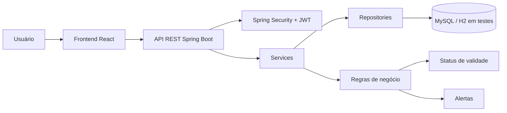

#  📦 noWaste — Controle Inteligente de Estoque 

<p align="center">
  <strong>Sistema fullstack para gestão de inventários, produtos, lotes e alertas de vencimento.</strong>
</p>

<p align="center">
  
  
  
  
  
</p>

---

## 🧾 Sumário

- [Sobre o projeto](#-sobre-o-projeto)
- [Problema e proposta de valor](#-problema-e-proposta-de-valor)
- [Equipe](#-equipe)
- [Stack utilizada](#-stack-utilizada)
- [Arquitetura da solução](#-arquitetura-da-soluçao)
- [Funcionalidades implementadas na Sprint 2](#-funcionalidades-implementadas)
- [Frontend implementado](#-frontend-implementado)
- [Backend implementado](#-backend-implementado)
- [Rotas da API](#-rotas-da-api)
- [Testes automatizados](#-testes-automatizados)
- [Evidências visuais](#-evidencias-visuais)
- [Como executar o projeto](#-como-executar-o-projeto)
- [Status do projeto](#-status-do-projeto-na-sprint-2)
- [Licença](#-licença)

---

## 🌱 Sobre o projeto

O **noWaste** é uma aplicação fullstack desenvolvida para apoiar o controle de estoque com foco em **lotes e datas de validade**. A proposta do sistema é ajudar empresas a reduzirem perdas, acompanharem produtos próximos do vencimento e organizarem inventários de forma mais clara.

Diferente de um controle simples de produtos, o noWaste trabalha com a relação entre:

```text
Usuário → Inventário → Produto → Lote → Alertas de validade
```

Essa estrutura permite que cada produto seja organizado dentro de um inventário e que cada lote tenha quantidade, validade, peso total calculado e status automático de vencimento.

- qual produto está armazenado
- em qual inventário ele está
- qual a quantidade disponível
- quando esse lote vence
- qual o status atual da validade

## 🎯 Problema e proposta de valor

Muitos comércios ainda controlam produtos perecíveis em planilhas ou de forma manual. Isso dificulta a identificação rápida de itens vencidos ou próximos da validade, causando desperdício e prejuízo.

O **noWaste** atua nesse cenário oferecendo:

| Problema observado | Solução proposta pelo noWaste |
|---|---|
| Produtos sem rastreio por lote | Cadastro de lotes vinculados a produtos |
| Vencimentos acompanhados manualmente | Status automático por data de validade |
| Falta de visão geral do estoque | Inventários separados por usuário |
| Perdas por produtos vencidos | Alertas de lotes vencidos, semanais e mensais |
| Dificuldade de consulta | Filtros por nome, categoria, marca, peso, lote, quantidade e validade |

### Público-alvo

- supermercados;
- mercearias;
- pequenos comércios;
- estoques de produtos perecíveis;
- negócios que precisam acompanhar validade por lote.

---

## 👨‍💻 Equipe

| Integrante | Responsabilidade |
|---|---|
| Gabriel Felipe | Product Owner |
| Isadora Rodrigues | Frontend |
| Wesley Carvalho | Scrum Master |
| Henrique Cezar | Backend |
| Gabrielly dos Santos | Frontend |

---

## 🧰 Stack utilizada

### Backend

| Tecnologia | Uso no projeto |
|---|---|
| Java 21 | Linguagem principal do backend |
| Spring Boot 4.0.4 | Estrutura principal da API |
| Spring Web MVC | Criação dos endpoints REST |
| Spring Data JPA | Persistência e repositories |
| Spring Security | Segurança e autenticação |
| JWT | Geração e validação de token |
| ModelMapper | Conversão entre entidades e DTOs |
| Lombok | Redução de código repetitivo |
| MySQL | Banco de dados local |
| H2 | Banco de apoio para testes |
| Maven | Gerenciamento de dependências |

### Frontend

| Tecnologia | Uso no projeto |
|---|---|
| React 19 | Criação da interface |
| Vite | Ambiente de desenvolvimento frontend |
| React Router DOM | Navegação entre páginas |
| CSS customizado | Identidade visual e responsividade |
| Axios | Preparação para comunicação HTTP com a API |
| Bootstrap | Apoio visual e componentes |

### Testes

| Ferramenta | Uso no projeto |
|---|---|
| JUnit 5 | Testes unitários e de integração |
| Mockito | Mocks de serviços e repositories |
| MockMvc | Testes de controllers REST |
| Cucumber | Cenários BDD em linguagem natural |
| JaCoCo | Estrutura de cobertura de testes |

---

## 🏗️ Arquitetura da solução



### Organização backend

```text
noWaste/
├── src/main/java/A3/project/noWaste/
│   ├── config/          # segurança, JWT, filtros e ModelMapper
│   ├── domain/          # entidades User, Inventory, Product e Batch
│   ├── dto/             # DTOs de entrada e resposta
│   ├── exceptions/      # exceções e padronização de erros
│   ├── infra/           # repositories JPA
│   ├── service/         # contratos de serviço
│   ├── service/impl/    # regras de negócio
│   └── ui/              # controllers REST
└── src/test/
    ├── java/            # testes unitários, services e controllers
    └── resources/       # cenários BDD em .feature
```

### Organização frontend

```text
nowaste-front/
├── src/
│   ├── App.jsx
│   ├── main.jsx
│   ├── pages/
│   │   ├── Home.jsx
│   │   ├── Register.jsx
│   │   ├── Login.jsx
│   │   ├── Inventory.jsx
│   │   ├── InventoryList.jsx
│   │   ├── InventoryProducts.jsx
│   │   └── services/api.js
│   └── components/
│       └── BatchesModal.jsx
└── package.json
```

---

## ✅ Funcionalidades implementadas

### Backend

- Autenticação via endpoint `/auth/login` com retorno de token.
- Cadastro e gerenciamento de usuários.
- Criação, consulta, atualização, exclusão, filtro e ordenação de inventários.
- Cadastro e listagem de produtos por inventário.
- Consulta global de produtos do usuário autenticado.
- Conversão de peso de produto de kg para gramas.
- Cadastro e gerenciamento de lotes.
- Geração automática de código de lote no padrão `LT-NOME_DO_PRODUTO-001`.
- Cálculo automático do status do lote com base na validade.
- Cálculo de dias restantes para vencimento.
- Cálculo do peso total do lote.
- Alertas de lotes vencidos.
- Alertas de lotes que vencem na semana.
- Alertas de lotes que vencem no mês atual.
- Testes unitários de domínio, services e controllers.
- Cenários BDD para produtos, lotes e alertas.

### Frontend

- Landing page institucional do noWaste.
- Tela de cadastro de empresa/usuário.
- Tela de login.
- Tela principal/painel de inventários.
- Tela de listagem de inventários.
- Tela de produtos por inventário.
- Modal/listagem de lotes.
- Telas e componentes visuais de alertas de validade.
- Interface com identidade visual padronizada.
- Navegação com React Router.
- Serviço `api.js` configurado com `baseURL: http://localhost:8080`.

---

## 🖥️ Frontend implementado

As telas desenvolvidas foram estruturadas focando em apresentação, organização visual e navegação simples para o usuário.

| Tela | Arquivo principal | Status |
|---|---|---|
| Landing page | `Home.jsx` | Concluída |
| Cadastro | `Register.jsx` | Concluída |
| Login | `Login.jsx` | Concluída |
| Painel de inventário | `Inventory.jsx` | Concluída |
| Listagem de inventários | `InventoryList.jsx` | Concluída |
| Produtos do inventário | `InventoryProducts.jsx` | Concluída |
| Modal de lotes | `BatchesModal.jsx` | Concluído |
| Serviço de API | `services/api.js` | Estruturado |

### Rotas frontend

```jsx
<Route path="/" element={<Home />} />
<Route path="/register" element={<Register />} />
<Route path="/login" element={<Login />} />
<Route path="/inventory" element={<Inventory />} />
<Route path="/inventory/:inventoryId" element={<InventoryProducts />} />
```

---

## ⚙️ Backend implementado

O backend foi organizado em camadas, separando responsabilidades entre controllers, services, repositories, DTOs, domínio e tratamento de exceções.

### Entidades principais

| Entidade | Papel |
|---|---|
| `User` | Representa o usuário/empresa do sistema |
| `Inventory` | Agrupa produtos de um usuário |
| `Product` | Representa o produto cadastrado no estoque |
| `Batch` | Representa o lote com quantidade e validade |

### Status de validade do lote

O domínio `Batch` calcula automaticamente o status conforme a data de validade:

```java
public String getStatus() {
    if (expirationDate == null) {
        return "UNKNOWN";
    }

    LocalDate today = LocalDate.now();
    long days = ChronoUnit.DAYS.between(today, expirationDate);

    if (days < 0) {
        return "EXPIRED";
    }
    if (days <= 7) {
        return "WARNING";
    }
    if (days <= 30) {
        return "MONTH_WARNING";
    }
    return "OK";
}
```

| Status | Significado |
|---|---|
| `EXPIRED` | Lote vencido |
| `WARNING` | Lote vence em até 7 dias |
| `MONTH_WARNING` | Lote vence entre 8 e 30 dias |
| `OK` | Lote com validade acima de 30 dias |
| `UNKNOWN` | Lote sem data de validade |

### Código automático de lote

Os lotes recebem código automático por produto:

```text
LT-NOME_DO_PRODUTO-001
LT-NOME_DO_PRODUTO-002
```

Exemplos:

```text
LT-ARROZ-001
LT-ARROZ-002
LT-FEIJAO_PRETO-001
```

---

## 🌐 Rotas da API

### Autenticação

| Método | Rota | Descrição |
|---|---|---|
| `POST` | `/auth/login` | Realiza login e retorna token |

### Usuários

| Método | Rota | Descrição |
|---|---|---|
| `GET` | `/users` | Lista usuários |
| `POST` | `/users` | Cadastra usuário |
| `PUT` | `/users/{id}` | Atualiza usuário |
| `DELETE` | `/users/{id}` | Exclui usuário |

### Inventários

| Método | Rota | Descrição |
|---|---|---|
| `GET` | `/inventories` | Lista inventários do usuário |
| `GET` | `/inventories/{id}` | Consulta inventário por ID |
| `POST` | `/inventories` | Cria inventário |
| `PUT` | `/inventories/{id}` | Atualiza inventário |
| `DELETE` | `/inventories/{id}` | Exclui inventário |

Filtros disponíveis:

```text
/inventories?name=mercado
/inventories?sort=asc
/inventories?sort=desc
```

### Produtos

| Método | Rota | Descrição |
|---|---|---|
| `GET` | `/products` | Lista produtos do usuário autenticado |
| `GET` | `/inventories/{inventoryId}/products` | Lista produtos de um inventário |
| `GET` | `/inventories/{inventoryId}/products/{productId}` | Consulta produto por ID |
| `POST` | `/inventories/{inventoryId}/products` | Cria produto |
| `PUT` | `/inventories/{inventoryId}/products/{productId}` | Atualiza produto |
| `DELETE` | `/inventories/{inventoryId}/products/{productId}` | Exclui produto |

Filtros disponíveis:

```text
?name=arroz
?category=graos
?brand=tio
?minWeight=500&maxWeight=2000
?sortWeight=asc
?sortWeight=desc
```

### Lotes

| Método | Rota | Descrição |
|---|---|---|
| `GET` | `/inventories/{inventoryId}/products/{productId}/batches` | Lista lotes de um produto |
| `GET` | `/inventories/{inventoryId}/products/{productId}/batches/{batchId}` | Consulta lote por ID |
| `POST` | `/inventories/{inventoryId}/products/{productId}/batches` | Cria lote |
| `PUT` | `/inventories/{inventoryId}/products/{productId}/batches/{batchId}` | Atualiza lote |
| `DELETE` | `/inventories/{inventoryId}/products/{productId}/batches/{batchId}` | Exclui lote |

Filtros disponíveis:

```text
?code=LT
?status=WARNING
?expirationFrom=2026-04-01&expirationTo=2026-04-30
?minQuantity=10&maxQuantity=50
?sortExpiration=asc
?sortExpiration=desc
```

### Alertas

| Método | Rota | Descrição |
|---|---|---|
| `GET` | `/alerts/month` | Lista lotes que vencem no mês atual |
| `GET` | `/alerts/week` | Lista lotes que vencem nos próximos 7 dias |
| `GET` | `/alerts/expired` | Lista lotes vencidos |

---

## 🧪 Testes automatizados

Realizamos a cobertura de testes no backend. O sistema possui testes para domínio, services, controllers e cenários BDD.

### Arquivos de teste

| Camada | Arquivos |
|---|---|
| Domínio | `BatchTest.java` |
| Services | `BatchImplTest.java`, `ProductImplTest.java`, `InventoryImplTest.java`, `UserImplTest.java`, `ExpirationAlertImplTest.java`, `VerificationServiceTest.java` |
| Controllers | `AuthControllerTest.java`, `BatchControllerTest.java`, `ProductControllerTest.java`, `InventoryControllerTest.java`, `UserControllerTest.java`, `ExpirationAlertControllerTest.java` |
| BDD | `alerts.feature`, `batches.feature`, `products.feature` |
| Runner BDD | `CucumberTest.java`, `CucumberSpringConfiguration.java` |

### Quantidade de testes

Foram realizados mais de **100 métodos com `@Test`** no backend.

### O que foi e está sendo testado

- cálculo de status de vencimento dos lotes;
- cálculo de dias restantes;
- cálculo de peso total do lote;
- geração automática e sequencial de código de lote;
- filtros e ordenações de lotes;
- cadastro, consulta, atualização e exclusão de inventários;
- validações de produtos e conversão de peso;
- bloqueio de e-mail duplicado;
- proteção contra alteração/exclusão de usuário diferente;
- identificação do usuário autenticado;
- endpoints de autenticação, usuários, inventários, produtos, lotes e alertas;
- cenários BDD para produtos, lotes e alertas.

### Executar testes do backend

Windows:

```bash
cd noWaste
.\mvnw.cmd test
```

Linux/macOS:

```bash
cd noWaste
./mvnw test
```

---

## 🖼️ Evidências visuais

As evidências abaixo documentam a execução de testes, endpoints da API e telas do frontend do sistema.

### Mapeamento das evidências

| Print | Evidência |
|---|---|---|
| Print 01 | Execução Maven/testes do backend |
| Print 02 | Testes unitários na IDE |
| Print 03 | Login JWT via API |
| Print 04 | Consulta de inventários via API |
| Print 05 | Endpoint `/alerts/month` |
| Print 06 | Endpoint `/alerts/week` |
| Print 07 | Tela de cadastro |
| Print 08 | Tela de login |
| Print 09 | Painel/listagem de inventários |
| Print 10 | Alertas no frontend |
| Print 11 | Landing page início |
| Print 12 | Landing page footer |

<details>
<summary><strong>Ver prints principais da Sprint 2</strong></summary>

<p align="center"></p>

<p align="center"></p>

<p align="center"></p>

<p align="center"></p>

<p align="center"></p>

<p align="center"></p>

<p align="center"></p>

<p align="center"></p>

<p align="center"></p>

<p align="center"></p>

<p align="center"></p>

<p align="center"></p>

</details>

<details>
<summary><strong>Ver telas adicionais do frontend</strong></summary>

<p align="center">

<p align="center">

<p align="center">

<p align="center">


</details>

---

## 🚀 Como executar o projeto

### Pré-requisitos

| Ferramenta | Versão/observação |
|---|---|
| Java | JDK 21 |
| Maven | Wrapper incluído no backend |
| MySQL | Banco local |
| Node.js | Recomendado para o frontend React/Vite |
| npm | Gerenciador de pacotes frontend |
| Git | Para clonar o projeto |

---

## 🔧 Executar backend

### 1. Clonar o repositório

```bash
git clone https://github.com/gabszinn/Nowaste.git
cd Nowaste/noWaste
```

### 2. Criar arquivo `.env`

```properties
TOKEN_SECRET=seu_token_secret
MYSQL_PORT_KEY=3306
MYSQL_DATABASE_NAME=nome_do_banco
MYSQL_USERNAME_KEY=seu_usuario
MYSQL_PASSWORD_KEY=sua_senha
```

### 3. Executar a aplicação

Windows:

```bash
.\mvnw.cmd spring-boot:run
```

Linux/macOS:

```bash
./mvnw spring-boot:run
```

A API ficará disponível em:

```text
http://localhost:8080
```

---

## 💻 Executar frontend

Acesse a pasta do frontend:

```bash
cd nowaste-front
```

Instale as dependências:

```bash
npm install
```

Execute o projeto:

```bash
npm run dev
```

O frontend será iniciado pelo Vite, normalmente em:

```text
http://localhost:5173
```

A configuração base de API está em:

```javascript
export const api = axios.create({
    baseURL: "http://localhost:8080",
});
```

### Erro ao validar JWT
Revise o valor configurado em:

```properties
TOKEN_SECRET
```

### Erro no build Maven
Tente executar:

```bash
./mvnw clean install
```

ou no Windows:

```bash
.\mvnw.cmd clean install
```

### Problema com versão do Java
O projeto foi configurado com:

```xml
<java.version>26</java.version>
```
---

## 📌 Status do projeto na Sprint 2

| Área | Situação |
|---|---|
| Backend de usuários | Implementado |
| Backend de autenticação | Implementado |
| Backend de inventários | Implementado |
| Backend de produtos | Implementado |
| Backend de lotes | Implementado |
| Backend de alertas | Implementado |
| Testes unitários | Implementados |
| Testes de controller | Implementados |
| Cenários BDD | Implementados |
| Frontend institucional | Implementado |
| Telas de cadastro e login | Implementadas |
| Telas de inventários/produtos/lotes | Implementadas |
| Telas de alertas | Implementadas |
| Integração visual frontend/backend | Estruturada |

---

## 🛠️ Problemas comuns

### Erro de conexão com MySQL

Verifique se:

- o MySQL está ativo;
- o banco existe;
- usuário e senha do `.env` estão corretos;
- a porta está configurada corretamente.

### Erro de autenticação JWT

Verifique se a variável abaixo está definida:

```properties
TOKEN_SECRET=seu_token_secret
```

### Frontend não conecta na API

Verifique se o backend está rodando em:

```text
http://localhost:8080
```

E se o arquivo `api.js` aponta para a mesma URL.

### Erro ao instalar dependências do frontend

Execute novamente:

```bash
npm install
```

Depois rode:

```bash
npm run dev
```

---

## 📄 Licença

Este projeto utiliza a licença **GPL-3.0**.
